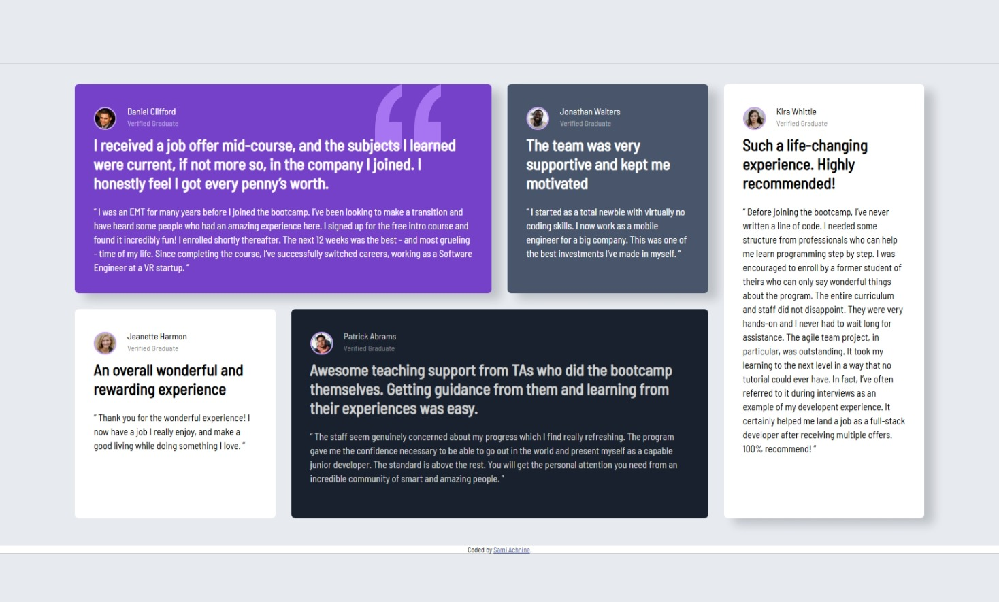
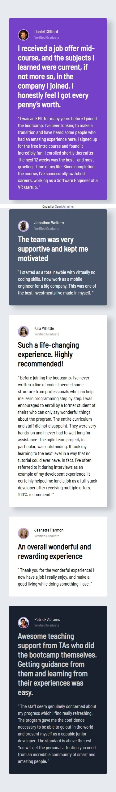

# CTI-110 Final Project - Testimonials Grid by Sami Achnine

## Table of contents

- [CTI-110 Final Project - Testimonials Grid by Sami Achnine](#cti-110-final-project---testimonials-grid-by-first-name-last-name)
  - [Table of contents](#table-of-contents)
  - [Overview](#overview)
    - [The challenge](#the-challenge)
    - [Screenshot](#screenshot)
    - [Links](#links)
  - [My process](#my-process)
    - [Built with](#built-with)
    - [What I learned](#what-i-learned)
    - [Continued development](#continued-development)
    - [Useful resources](#useful-resources)
  - [Author](#author)
  - [Acknowledgments](#acknowledgments)

## Overview

This site is a recreation of the below screenshot in HTML/CSS as best as I can get it.
See the site in the link further down this README.

### The challenge

Users should be able to:

- View the optimal layout for the interface depending on their device's screen size

### Screenshots

Left: Desktop. Right: Mobile.




### Links

- Repository URL: [https://github.com/SamiAchnine/Achnine-CTI110-FinalProject](https://github.com/SamiAchnine/Achnine-CTI110-FinalProject)
- Live Site URL: [https://samiachnine.github.io/Achnine-CTI110-FinalProject/](https://samiachnine.github.io/Achnine-CTI110-FinalProject/)

## My process

### Built with

- CSS custom properties
- Flexbox (...for mobile view)
- CSS Grid (...for desktop view)
- Workflow that keeps mobile users in mind

#### _A NOTE ABOUT AI:_

No AI was used in the making of this website.

### What I learned

The structure of my HTML code is what I'm most proud of, more specifically how well organized the code turned out with all the div tags inside each other. I'm also quite proud of this segment:

```html
<link
  rel="stylesheet"
  href="https://fonts.googleapis.com/css?family=Barlow+Semi+Condensed"
/>
```

To get the font, usually people pull the .ttf file from the same server that the site itself is hosted on, and then link it in the CSS that way. However, that solution is way more complicated than it needs to be, as you can put this link in the html, then use the font like any other built-in font! Very simple and very epic.

My favorite CSS snippets!

```css
.parent {
  display: grid;
  grid-template-columns: repeat(4, 1fr);
  grid-template-rows: repeat(2, 1fr);
  gap: 25px;
}
/* This section of CSS handles the grid layout for the entire Desktop site. Thanks to a tool I found online, this code was copy-pasted into the site easy peasy! */
.DANIEL {
  grid-column: span 2 / span 2;
  background: hsl(263, 55%, 52%) url("./images/bg-pattern-quotation.svg") no-repeat
    top right 80px;
  border-radius: 6px;
  padding: 30px;
  color: white;
  font-size: 13px;
  box-shadow: 15px 10px 15px hsla(219, 29%, 14%, 0.2);
}
/* Daniel is the only person who has the quote image in their testimonials box, and I learned thanks to Mithun that you can put images directly into your CSS. Super helpful, since I had spent approxomately 90 minutes across multiple classes trying to get the image in the right spot with HTML. */
```

### Continued development

Use this section to outline areas that you want to continue focusing on in future projects. These could be concepts you're still not completely comfortable with or techniques you found useful that you want to refine and perfect.

**Note: Delete this note and the content within this section and replace with your own plans for continued development.**

### Useful resources

- [Fonts in CSS - W3Schools](https://www.w3schools.com/css/css3_fonts.asp) - This source just gave me a bunch of tips on how to link TTF fonts to CSS. I didn't end up using it, as the Google Fonts solution worked better for me, but in the future if I need it I will use this source.
- [Mozilla Developer Resources - Font Weight](https://developer.mozilla.org/en-US/docs/Web/CSS/Reference/At-rules/@font-face/font-weight) - Font weight is really weird. Thankfully, the Google fonts API lets you get any font weight, but the style guide only permits 500 and 600. Learning how to import the correct font weight (before I changed to the Google Fonts API) is very important.
- [inline-block Resource - W3Schools](https://www.w3schools.com/css/tryit.asp?filename=trycss_inline-block_nav) - Whoever invented inline-block needs to be sent to the furthest reaches of the universe, never to be seen again. Even after reading this entire page and taking in the knowledge, inline-block still doesn't work properly for me, but maybe I will eventually learn after rereading it for the 83rd time.
- [Mozilla Developer Resources - box-shadow](https://developer.mozilla.org/en-US/docs/Web/CSS/Reference/Properties/box-shadow) - box-shadow is really cool, and I noticed a very subtle drop shadow from each box in the original image, so learning how to use box-shadow is important to make that happen in the final page. This page is helpful in seeing how many parameters you need.
- [CSS Trick - Font Kerning](https://css-tricks.com/almanac/properties/f/font-kerning/) - Kerning is an important part of typeface design, and despite the fact that, in the end, I didn't need to change the kerning for any text, knowing how to modify the font kerning in HTML is very helpful. Glad I learned this.
- [How to make a fixed footer in CSS - W3Schools](https://www.w3schools.com/howto/howto_css_fixed_footer.asp) - At the very end of the project, I realized that my footer was all wrong and messed up, so I ended up sticking it back to where it belonged. This page was very helpful in finding the right CSS rules to implement.

## Author

- Personal Website - [Click!](https://wecib-juniors.github.io/personal-website-project-SamiAchnine/)
- Github Profile - [Click!](https://github.com/SamiAchnine)

## Acknowledgments
